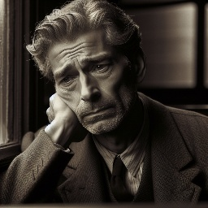

---

## Intro-domain real image-based speech synthesis

| 
 Reference Face 
 | 
 Text 
 | 
 MM-StyleSpeech 
| 
 MM-TTS 
| 
 FaceSpeak 
|
| -----------     |  -----------     | -----------     |  -----------     |  -----------     |
|    | In many of his poems death comes by train a strongly evocative visual image. |  <audio src="Resource/mead/mmss/face_M003_angry_level_3_019.wav" controls preload></audio>  | <audio src="Resource/mead/mmtts/face_M003_angry_level_3_019.wav" controls preload></audio>  | <audio src="Resource/mead/facespeak/angry.wav" controls preload></audio>|
|    | His artistic accomplishments guaranteed him entry into any social gathering. |  <audio src="Resource/mead/mmss/face_M003_happy_level_3_017.wav" controls preload></audio>  | <audio src="Resource/mead/mmtts/face_M003_happy_level_3_017.wav" controls preload></audio>  | <audio src="Resource/mead/facespeak/happy.wav" controls preload></audio>  |
|   | She had your dark suit in greasy wash water all year.|  <audio src="Resource/mead/mmss/face_M005_sad_level_1_001.wav" controls preload></audio>  | <audio src="Resource/mead/mmtts/face_M005_sad_level_1_001.wav" controls preload></audio>  | <audio src="Resource/mead/facespeak/sad.wav" controls preload></audio>  |
|   | Barb burned paper and leaves in a big bonfire. |  <audio src="Resource/mead/mmss/face_M007_disgusted_level_2_010.wav" controls preload></audio>  | <audio src="Resource/mead/mmtts/face_M007_disgusted_level_2_010.wav" controls preload></audio>  | <audio src="Resource/mead/facespeak/disgusted.wav" controls preload></audio>  |
|   | Will you tell me why. |  <audio src="Resource/mead/mmss/face_W018_surprised_level_2_003.wav" controls preload></audio>  | <audio src="Resource/mead/mmtts/face_W018_surprised_level_2_003.wav" controls preload></audio>  | <audio src="Resource/mead/facespeak/surprise.wav" controls preload></audio>  |
|   | Destroy every file related to my audits. |  <audio src="Resource/mead/mmss/face_W021_fear_level_2_009.wav" controls preload></audio>  | <audio src="Resource/mead/mmtts/face_W021_fear_level_2_009.wav" controls preload></audio>  | <audio src="Resource/mead/facespeak/fear.wav" controls preload></audio>  |

## Out-of-domain real image-based speech synthesis

| 
 Reference Face 
 | 
 Text 
 | 
 MM-StyleSpeech 
| 
 MM-TTS 
| 
 FaceSpeak |
| -----------     |  -----------     | -----------     |  -----------     |  -----------     |
|    | Haste, lest you damn me to spend eternity as a filthy gaunt of darkness. |  <audio src="Resource/Oulu/mmss/face_P002_Disgust_011_W.wav" controls preload></audio>  | <audio src="Resource/Oulu/mmtts/face_P002_Disgust_011_W.wav" controls preload></audio>  | <audio src="Resource/Oulu/facespeak/P002_Disgust_1_1_011_1.wav" controls preload></audio>  |
|     | Immediately she pointed to the bank out of which she had emerged and said, "House no good, house no good!" |  <audio src="Resource/Oulu/mmss/face_P006_Anger_017_M.wav" controls preload></audio>  | <audio src="Resource/Oulu/mmtts/face_P006_Anger_017_M.wav" controls preload></audio>  | <audio src="Resource/Oulu/facespeak/P006_Anger_1_1_017_0.wav" controls preload></audio>  |
|     | So o k, go ahead, you can finish it."|  <audio src="Resource/Oulu/mmss/face_P008_Sadness_020_M.wav" controls preload></audio>  | <audio src="Resource/Oulu/mmtts/face_P008_Sadness_020_M.wav" controls preload></audio>  | <audio src="Resource/Oulu/facespeak/P008_Sadness_1_1_020_0.wav" controls preload></audio>  |
|     | There was silence then and, still wondering, Brion was once more asleep. |  <audio src="Resource/Oulu/mmss/face_P009_Anger_020_W.wav" controls preload></audio>  | <audio src="Resource/Oulu/mmtts/face_P009_Anger_020_W.wav" controls preload></audio>  | <audio src="Resource/Oulu/facespeak/P009_Anger_1_1_020_1.wav" controls preload></audio>  |
|     | There are many trustworthy men, and men of Christian faith, to vouch for these and similar events occurring as foretold.|  <audio src="Resource/Oulu/mmss/face_P012_Fear_019_M.wav" controls preload></audio>  | <audio src="Resource/Oulu/mmtts/face_P012_Fear_019_M.wav" controls preload></audio>  | <audio src="Resource/Oulu/facespeak/P012_Fear_1_1_019_0.wav" controls preload></audio>  |
|    | As soon as I was with her as I should be, She said to me: "Why, brother, dost thou not Venture to question now, in coming with me?" |  <audio src="Resource/Oulu/mmss/face_P046_Surprise_013_M.wav" controls preload></audio>  | <audio src="Resource/Oulu/mmtts/face_P046_Surprise_013_M.wav" controls preload></audio>  | <audio src="Resource/Oulu/facespeak/P046_Surprise_1_1_013_0.wav" controls preload></audio>  |

## Multi-style image-based speech synthesis

| 
 Reference Face 
 | 
 Text 
 |  
 FaceSpeak 
|
| -----------     |  -----------     | -----------     |
|  | His shoulder felt as if it were broken. |<audio src="Resource/multi-style/sad1.wav" controls preload></audio> |
|  | His shoulder felt as if it were broken. |  <audio src="Resource/multi-style/angry1.wav" controls preload></audio>  |
|  | One even gave my little dog a biscuit. |  <audio src="Resource/multi-style/happy1.wav" controls preload></audio>  |
|  | No the man was not drunk he wondered how he got tied up with this stranger. | <audio src="Resource/multi-style/sad2.wav" controls preload></audio> |
|  | No the man was not drunk he wondered how he got tied up with this stranger. | <audio src="Resource/multi-style/fear1.wav" controls preload></audio> |
|  | He ate four extra eggs for breakfast. | <audio src="Resource/multi-style/surprise1.wav" controls preload></audio> |
|  | Lighted windows glowed jewel bright through the downpour. |  <audio src="Resource/multi-style/happy2.wav" controls preload></audio> |
|  | The plaintiff in school desegregation cases. |  <audio src="Resource/multi-style/sad3.wav" controls preload></audio> |
|  | Why else would Danny allow others to go? | <audio src="Resource/multi-style/angry2.wav" controls preload></audio> |
|  | Obviously the bridal pair has many adjustments to make to their new situation. |  <audio src="Resource/multi-style/happy3.wav" controls preload></audio>|
|  | Who authorized the unlimited expense account? | <audio src="Resource/multi-style/angry4.wav" controls preload></audio> |
|  | The revolution now under way in materials handling makes this much easier. | <audio src="Resource/multi-style/sad4.wav" controls preload></audio> |

## Diffenent image controlled speech synthesis

| 
 Emotional Reference 
 | 
 Speaker Reference 
 |  
 Text 
 | 
 FaceSpeak 
|
| -----------     |  -----------     | -----------     | -----------     |
|  |  | Tom will become a good soccer player some day. | <audio src="Resource/multi_image_controlled/1.wav" controls preload></audio> |
|  |  | He stole a dime from a beggar. |  <audio src="Resource/multi_image_controlled/2.wav" controls preload></audio>  |
|  |  | However the litter remained augmented by several dozen lunchroom suppers. |  <audio src="Resource/multi_image_controlled/3.wav" controls preload></audio>  |
|  |  | But the ships are very slow now and we don't get so many sailors any more. | <audio src="Resource/multi_image_controlled/4.wav" controls preload></audio> |